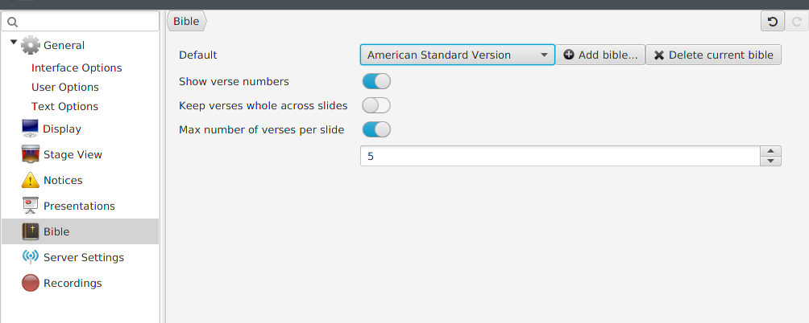

# Bible tab

The Bible tab lets you select a default Bible, add a Bible, select
whether or not verse numbers should be displayed in bible passages and
adjust the layout of a Bible passage.

## Default Bible

To set a default bible, simply click the drop-down menu and select one
of the installed bibles. This will later be the default option when you
add a new Bible passage (you might need to restart Quelea for the
changes to take effect).

## Add a Bible

If you want to add a Bible, click the “Add bible...” button. 

This allows you to browse to a downloaded Bible of type XML or XMM. If you wish to
download a Bible, you find XMM bibles in various languages here:
<http://www.opensong.org/pages/downloads.html> 

And XML bibles in several languages here:
<http://sourceforge.net/projects/zefania-sharp/files/Bibles/>

Of course; after you have added a Bible, it can also be used as the
default Bible.

## Remove a Bible

Select the Bible you want to delete in the dropdown menu and then click the button
"Delete current bible". You can also manually delete it by removing the file from
the `.quelea` folder in you user directory.

## Layout of Bible passages

### Show verse numbers

Your first option is whether or not you want the verse numbers to be
visible or not. By default this is activated and small numbers will be
visible in the beginning of each verse, both in the regular output and
the Mobile Lyrics.

### Keep verses whole across slides

This option will allow you to determine whether
the text should be divided into slides after a certain amount of words
(to maintain as high font size as possible) or at the end of a verse
after a certain amount of words (to ensure that you will not have to
change slide in the middle of a verse).

### Max number of verses per slide

The last option overrides the above and allows you to determine how many
verses you would like to display per slide. A higher number usually
means smaller font size, since more text needs to be fitted into the
screen.

-----

[← Notices tab](Notices_tab "Notices tab") &nbsp;&nbsp;&nbsp;&nbsp;&nbsp;&nbsp;&nbsp;&nbsp;&nbsp;&nbsp;&nbsp;&nbsp;&nbsp;&nbsp;&nbsp;&nbsp;&nbsp;&nbsp;&nbsp;&nbsp;&nbsp;&nbsp;&nbsp;&nbsp;
[Server Settings tab →](Server_Settings_tab "Server Settings tab")

---
